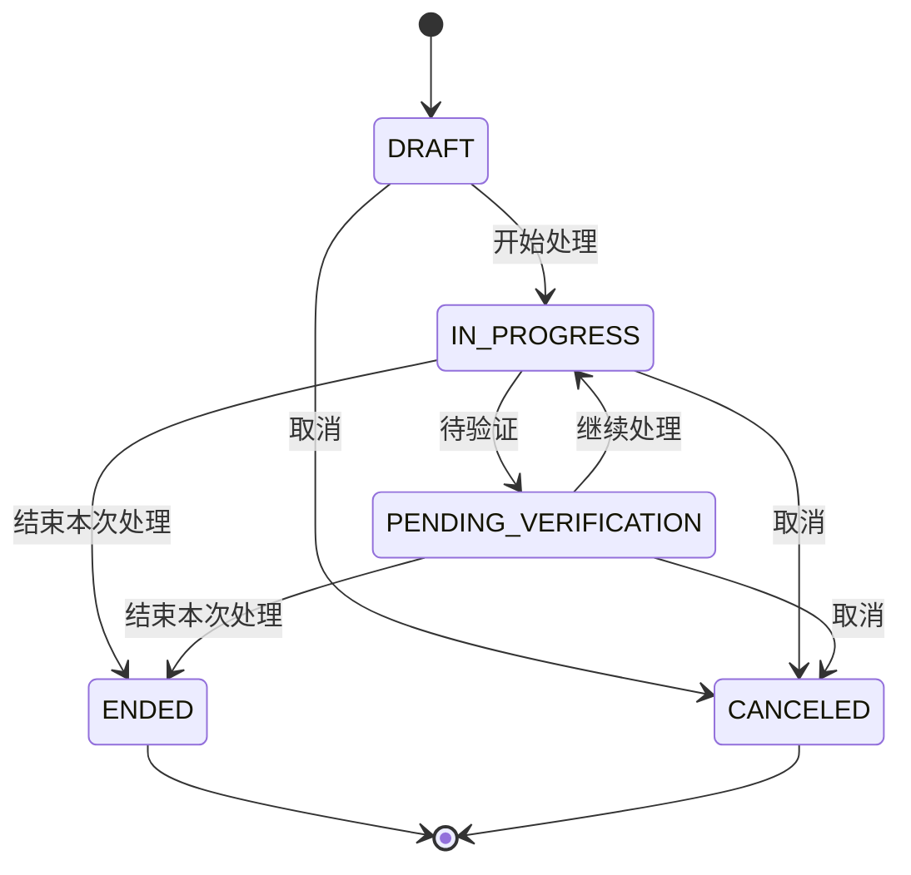

# CODA｜现场工作助手 MVP 技术设计稿

> 文档状态：v1.1.1（v1.1 冻结修订 + 已批准的 v1.1.1 实现等价修订；M7 收口补 v1.1.2 等价修订见 §2.4）
> 产品基线（v1.0，不修改）：`outputs/electrician-workbench-mvp-product-design.md`
> UI 规格参考（v1.1）：`outputs/coda-mvp-ui-design-spec.md`
> 视觉稿参考（v1.1）：`outputs/coda-mvp-visual-design-spec.md`
> 适用范围：CODA 个人离线 Android MVP
> 本稿目标：将产品定稿转换为可开发、可测试的技术规格。

> v1.1 冻结范围：产品定稿仍为 v1.0 且不可修改；本稿与 UI 规格、视觉稿统一为 v1.1 派生稿。v1.1 只澄清既有规则、接口边界和验收动作，不新增产品状态、数据字段或入口。

## 1. 目标与边界

### 1.1 技术目标

- 无网络、无账号、无后台服务时，仍可建立、编辑、完成、查询和备份记录。
- 现场快速录入只依赖最小字段，离开页面或 App 异常退出后可继续编辑。
- 故障处理、派生工作记录和交接事项保持原子一致，重复点击不产生重复数据。
- 历史记录保存当时的出勤和班次快照，未来修改排班不重分类历史。
- 备份文件可在另一台安装同一 App 的 Android 手机上校验并恢复。

### 1.2 MVP 不实现

正式考勤、工时/工资、图片/PDF/视频/音频附件库、OCR/PDF 全文检索、隐患管理、备件请购、多用户协作、审批权限、云同步、在线冲突合并、AI 诊断、网页抓取和复杂报表均不进入首版代码路径。

早期设计中出现的附件、资料、隐患和备件能力保留为后续扩展方向，不得为了兼容旧稿而提前引入表结构或首屏入口。

## 2. 技术基线

### 2.1 推荐栈

| 层 | 方案 | 约束 |
| --- | --- | --- |
| 语言 | Kotlin | 所有业务规则使用可测试的 Kotlin 纯函数或用例 |
| UI | Jetpack Compose + Material 3 | 单向数据流，屏幕不直接操作 DAO |
| 导航 | 手写路由状态机（§2.3-3 批准的等价实现） | `AppRoute` 密封接口 + 返回栈；首页四入口和设置页使用显式路由 |
| 本地数据库 | Room + SQLite | 外键、唯一索引和事务由数据库保证 |
| 设置 | Jetpack DataStore Preferences | 只保存通知开关等非业务偏好 |
| 异步 | Kotlin Coroutines + Flow | DAO 通过 Flow 暴露列表和首页聚合数据 |
| 依赖注入 | Hilt | 统一组装 Database、DAO、Repository、Clock 和 ViewModel |
| 本地提醒 | 非精确 AlarmManager（见 §2.4-1） | 到期提醒允许系统漂移，不申请精确闹钟权限；不引入 WorkManager，补偿由自续期维护闹钟承担 |
| 序列化 | org.json（见 §2.4-2） | 备份 JSON 使用版本化 DTO，不直接序列化 Room Entity |
| 文件访问 | Storage Access Framework | 仅用于备份导入/导出，不持久化外部 URI 作为业务关系 |

默认 `minSdk` 为 26，`targetSdk` 和依赖版本使用项目初始化时的稳定版本。若现场设备低于 API 26，需要在开工前单独评估 Java 时间 API 脱糖，不在本稿中隐式支持。

### 2.2 架构形态

首版采用单 APK、单本地数据库、离线优先架构，不建立网络层。代码按职责分包，不提前拆成多模块：

```text
app/
  core/model/          纯 Kotlin 领域枚举、值对象
  core/rules/          状态机、排班、文本规则（原 core/common 职责并入此处）
  core/usecase/        用例（§2.3-2 批准：原 domain/usecase 并入 core）
  data/local/          Room Entity、Dao、Database、Migration
  data/backup/         备份 DTO、ZIP、校验、导入事务
  data/repository/     Repository 实现
  platform/            通知调度、闹钟网关、文件选择器、备份文件存储等平台适配
  di/                  Hilt 组合根
  ui/                  按页面组织的 Compose 屏幕与 ViewModel（原 feature/* 按实际代码改为 ui/）
  ui/theme/            Compose 主题、颜色与字体（原 core/design 职责）
```

> 本节树形已于 M8 收口按 §2.3-2/§2.3-3 与实际代码回改：`domain/usecase → core/usecase`、`feature/* → ui/*`、`core/design → ui/theme`、`core/common` 职责并入 `core/rules`，`navigation/` 由 §2.3-3 手写路由替代。仓库中遗留的空目录壳 `domain/`、`feature/` 无源码，属清理项。

屏幕使用 `ViewModel -> UseCase -> Repository -> Room` 链路（§2.3-2 认可的直连形态）。依赖方向固定为：`ui -> core/usecase -> data`，`data -> core(model/rules)`，`platform` 通过注入供用例使用；`core/model`、`core/rules` 不依赖任何其他层，由 App 组合根（`di/`）通过 Hilt 组装实现。ViewModel 只编排 UI 状态和导航，不包含状态转换、排班算法或备份替换逻辑。

Hilt 只负责依赖组装，不承载业务规则。Database、DAO 和 Repository 使用单例范围；ViewModel 使用页面范围；正式运行注入系统 `Clock`，测试注入固定时间的 Fake Clock。

### 2.3 v1.1.1 修订（2026-08-15，已批准）

本节把代码已采用的等价实现声明为认可，不改变任何产品范围、数据字段或业务规则。

1. **错误处理体系（对应 §3.1、§5）**：MVP 认可异常式错误处理为 `AppResult` 的等价实现。用例失败以 Kotlin 异常表达，`Conflict` 语义由带明确中文消息的 `IllegalStateException` 承载，ViewModel 层统一捕获并呈现。约束：①新增用例失败路径必须给出可展示的中文错误消息；②存储/备份类错误在 M7 引入具体异常子类；③v2.0 引入协作与网络层时，迁移到 `AppResult` 并升级版本。
2. **分层依赖（对应 §2.2）**：MVP 认可"用例直连数据层"的单模块等价形态（`core/usecase` 注入 `CodaDatabase`/DAO，Hilt 组合根组装）。约束：①UI 层不得绕过用例直接使用 DAO；②跨层不得出现反向依赖；③出现第二个数据源（网络同步，v2.0）前必须抽 Repository 接口。
3. **导航与平台目录（对应 §2.1、§2.2）**：MVP 认可手写路由状态机（`AppRoute` 密封接口 + 返回栈，支持逐级返回与系统返回手势）。约束：①M5 通知调度器、M7 文件选择器必须放入新建的 `platform/` 包并保持可测试注入；②M6 收口时评估页面数，若 MainActivity 不可维护再引入 navigation-compose。
4. **首页查询模式（对应 §6.1）**：MVP 认可"一次性快照 + 页面进入刷新"模式。约束：出现跨页面实时联动需求时切换 Flow 订阅。

### 2.4 v1.1.2 修订（M7 收口，已批准）

本节延续 §2.3 的口径，把 M5/M7 交付采用的等价实现声明为认可，不改变任何产品范围、数据字段或业务规则。

1. **本地提醒实现（对应 §2.1、§9.1）**：MVP 认可"纯非精确 AlarmManager"为"非精确 AlarmManager + WorkManager"的等价实现。到期/下一班提醒用一次性非精确闹钟（`setAndAllowWhileIdle`），逾期去重与每月 1 号排班提示由自续期每日维护闹钟（每日 09:00，接收器处理后重排下一次）承载，BOOT_COMPLETED/TIME_SET/TIMEZONE_CHANGED 后从数据库重建。约束：①不引入 WorkManager 依赖；②不申请 `SCHEDULE_EXACT_ALARM`；③任何接收器路径不得因业务异常崩溃进程。
2. **备份序列化（对应 §2.1、§10.1）**：MVP 认可 Android 内置 `org.json` 为 kotlinx.serialization 的等价实现，备份文件仍使用独立版本化 DTO（§10.1），不直接序列化 Room Entity。约束：①协议 v1 字段名视为冻结，变更必须升级 `formatVersion`；②不新增第三方序列化依赖。
3. **导入读取方式（对应 §10.3）**：MVP 认可"内存全量读取（64MB 上限）"为"先复制到临时目录"的等价实现，校验在完整拷贝之后、任何数据库写入之前完成。

## 3. 领域模型与数据库

### 3.1 通用约定

- 所有实体主键使用 UUID v4 字符串，导入时不重新生成。
- `createdAt`、`updatedAt`、`completedAt` 等瞬时字段使用 UTC epoch milliseconds 保存。
- `businessDate` 使用 `yyyy-MM-dd` 的设备本地日期字符串。
- 展示时统一通过注入的 `Clock` 和 `ZoneId` 转换；禁止直接调用系统时间，便于测试跨午夜和日期切换。
- 文本写入前执行 trim、连续空白折叠和 Unicode NFKC 规范化；原文内容不改写，只将规范化值用于搜索。
- 已结束记录不能物理删除；故障和工作记录写入 `status = VOIDED`，交接事项保留业务状态并写入 `voidedAt`，再从默认列表过滤。

时间政策：瞬时字段保存 UTC epoch milliseconds，恢复到另一台设备后按新设备时区显示；`businessDate`、`shiftBusinessDate` 和班次快照是不可重算的业务字段，保持原记录值。这是首版在跨时区场景下的明确取舍。

版本政策：Room 的 `roomSchemaVersion` 只负责数据库迁移；备份的 `formatVersion`/`minReaderVersion` 只负责备份文件兼容；DataStore 的 `preferencesSchemaVersion` 只负责本机偏好迁移。三者是独立版本轴，不要求数值一致；跨层转换必须通过显式适配器完成，数据库迁移不会自动改变备份协议。

错误政策：命令型用例使用统一的 `AppResult<T>` 和 `AppError`，至少覆盖 `StorageFull`、`DatabaseFailure`、`ValidationFailure`、`BackupFormatInvalid`、`PermissionDenied` 和状态冲突 `Conflict`。列表型 `Flow` 保持数据流语义，在 ViewModel 层通过 `catch` 映射错误；不强迫所有持续查询都包装成一次性 `Result`。**等价实现（§2.3-1）：代码采用异常式错误处理，`AppResult`/`AppError` 为描述性伪类型、不在代码中出现；`Conflict` 语义由带中文消息的 `IllegalStateException` 承载，接口签名以代码为准。**

### 3.2 核心实体

#### `device`

| 字段 | 类型 | 说明 |
| --- | --- | --- |
| `id` | TEXT PK | UUID |
| `name` | TEXT | 标准名称，必填 |
| `normalizedName` | TEXT | 搜索用 |
| `isActive` | INTEGER | 停用不从建议列表显示，历史关系保留 |
| `createdAt` / `updatedAt` | INTEGER | 时间戳 |

别名放在 `device_alias(deviceId, alias, normalizedAlias)`，对 `normalizedAlias` 建唯一索引。同一设备的标准名和别名都参与搜索。首版产品口径中的“用户补充关键词”由设备别名承载，不新增独立关键词字段；该映射只扩展设备关联记录的可检索词。设备不建立设备树、资产编号或复杂主数据。

#### `fault_record`

| 字段 | 类型 | 说明 |
| --- | --- | --- |
| `id` | TEXT PK | 故障主记录 UUID |
| `deviceId` | TEXT FK | 必填，关联 `device` |
| `deviceNameSnapshot` | TEXT | 防止设备改名影响历史展示 |
| `reportedAt` | INTEGER | 接报时间，可修改 |
| `symptom` | TEXT | 故障现象，快速录入必填 |
| `lifecycleStatus` | TEXT | `OPEN`、`CLOSED`、`VOIDED` |
| `lastProcessingId` | TEXT NULL | 当前处理记录 |
| `createdAt` / `updatedAt` | INTEGER | 时间戳 |
| `voidedAt` | INTEGER NULL | 作废时间 |

故障主记录代表持续存在的问题；一次实际检查、维修或复测由 `fault_processing` 表示。

#### `fault_processing`

| 字段 | 类型 | 说明 |
| --- | --- | --- |
| `id` | TEXT PK | 处理记录 UUID |
| `faultId` | TEXT FK | 必填，关联故障 |
| `progressStatus` | TEXT | `DRAFT`、`IN_PROGRESS`、`PENDING_VERIFICATION`、`ENDED`、`CANCELED` |
| `restoreResult` | TEXT NULL | `RESTORED`、`TEMPORARY`、`PARTIAL`、`NOT_RESTORED`、`UNKNOWN` |
| `startedAt` / `endedAt` | INTEGER NULL | 处理起止时间 |
| `checkResult` | TEXT NULL | 检查结果，可稍后补充 |
| `initialJudgement` | TEXT NULL | 初步判断，可稍后补充 |
| `rootCause` | TEXT NULL | 最终原因，可稍后补充 |
| `measures` | TEXT NULL | 处理措施，可稍后补充 |
| `verification` | TEXT NULL | 验证结果，在结束处理时补充 |
| `createdAt` / `updatedAt` | INTEGER | 时间戳 |
| `completedAt` | INTEGER NULL | 结束本次处理的时间 |
| `voidedAt` | INTEGER NULL | 作废时间 |

#### `work_log`

| 字段 | 类型 | 说明 |
| --- | --- | --- |
| `id` | TEXT PK | 工作记录 UUID |
| `kind` | TEXT | `MANUAL` 或 `FAULT_DERIVED` |
| `content` | TEXT | 普通工作内容或派生摘要 |
| `workDate` | TEXT | 工作列表归属日期；普通记录取自然日，故障派生记录取出勤业务日 |
| `attendanceId` | TEXT NULL | 当前出勤标记，可为空 |
| `attendanceKindSnapshot` | TEXT NULL | 创建时的普通/顶白/顶夜/自定义快照 |
| `attendanceStartAt` / `attendanceEndAt` | INTEGER NULL | 创建时出勤起止快照 |
| `productionGroupSnapshot` | TEXT NULL | 创建时甲/乙班快照 |
| `shiftIdSnapshot` | TEXT NULL | 创建时班次 ID 快照 |
| `shiftBusinessDateSnapshot` | TEXT NULL | 创建时班次业务日期快照 |
| `shiftTypeSnapshot` | TEXT NULL | 创建时白班/夜班快照 |
| `shiftStartAtSnapshot` / `shiftEndAtSnapshot` | INTEGER NULL | 创建时班次起止快照 |
| `isShiftChangeSnapshot` | INTEGER NULL | 创建时转班标记快照 |
| `workResult` | TEXT NULL | 普通工作结果，可稍后补充 |
| `deviceId` | TEXT NULL | 普通工作可选关联设备 |
| `area` | TEXT NULL | 普通工作可选区域 |
| `deviceNameSnapshot` | TEXT NULL | 派生记录使用 |
| `processingStartedAt` / `processingEndedAt` | INTEGER NULL | 派生记录保存的本次处理起止时间快照 |
| `processedAt` | INTEGER NULL | 派生记录完成时间，兼容列表排序和展示 |
| `restoreResult` | TEXT NULL | 派生记录恢复结果 |
| `arrangementSource` | TEXT NULL | 普通工作安排来源，可稍后补充 |
| `sourceType` | TEXT NULL | 派生来源类型，首版为 `FAULT_PROCESSING` |
| `sourceId` | TEXT NULL | 派生来源 ID |
| `status` | TEXT | `ACTIVE` 或 `VOIDED` |
| `createdAt` / `updatedAt` | INTEGER | 时间戳 |
| `voidedAt` | INTEGER NULL | 作废时间 |

对 `sourceType + sourceId` 建唯一索引；两列同时为空只允许 `MANUAL` 记录。派生记录保留结束当时的摘要和班次快照，后续不能单独编辑，修正必须回到处理记录。出勤和班次快照直接落在 `work_log`，不依赖未来的 `attendance` 或 `shift_slot` 查询。

`workDate` 与 `shiftBusinessDateSnapshot` 语义分离：普通工作默认使用用户选择的自然日；故障派生工作记录使用出勤快照的 `shiftBusinessDateSnapshot`（即出勤开始那天的业务日期）。顶夜班跨午夜时，`workDate` 仍归出勤开始日，记录通过 `attendanceId` 和班次快照归入同一次出勤。

数据库必须同时约束来源字段：`sourceType` 和 `sourceId` 要么同时为空，要么同时非空；两列同时为空时 `kind` 必须为 `MANUAL`；`kind = FAULT_DERIVED` 时两者必须非空且 `sourceType = FAULT_PROCESSING`。Room 生成表结构无法直接表达这些条件时，在新装建库和每次 Migration 中通过建表 CHECK 约束或等价校验触发器落地，不能只依赖 ViewModel 判定。首版两种 kind 的约束语义等价于：`CHECK ((kind = 'MANUAL' AND sourceType IS NULL AND sourceId IS NULL) OR (kind = 'FAULT_DERIVED' AND sourceType = 'FAULT_PROCESSING' AND sourceId IS NOT NULL))`。

#### `handover_item`

| 字段 | 类型 | 说明 |
| --- | --- | --- |
| `id` | TEXT PK | 事项 UUID |
| `summary` | TEXT | 事项摘要 |
| `status` | TEXT | `PENDING_HANDOVER`、`HANDED_OVER`、`IN_PROGRESS`、`COMPLETED`、`CANCELED` |
| `nextAction` | TEXT | 下一步动作，必填 |
| `dueKind` | TEXT | `NEXT_SHIFT`、`END_OF_TODAY`、`SPECIFIC`、`NONE` |
| `dueAt` | INTEGER NULL | 具体到期时刻，`NONE` 为空 |
| `originType` | TEXT | `MANUAL` 或 `AUTO_FAULT_PROCESSING` |
| `sourceType` / `sourceId` | TEXT NULL | 来源故障处理或工作记录 |
| `handoverGroup` | TEXT NULL | `A`、`B` 或空 |
| `potentialHazardNote` | TEXT NULL | 仅作为可选备注，不实现隐患管理 |
| `lastOverdueNoticeDate` | TEXT NULL | 去重逾期通知 |
| `createdAt` / `updatedAt` | INTEGER | 时间戳 |
| `completedAt` | INTEGER NULL | 完成时间 |
| `voidedAt` | INTEGER NULL | 作废时间；不改变 `status` |

交接摘要在数据库中保存为非空文本：自动派生事项使用故障/处理摘要，手动事项的空输入由用例归一化为“待跟进事项”。因此 UI 可以把摘要标为选填，但列表始终有可展示标题。

自动派生交接事项使用 `originType = AUTO_FAULT_PROCESSING`、`sourceType = FAULT_PROCESSING`、`sourceId = processingId`，创建部分唯一索引（`WHERE originType = AUTO_FAULT_PROCESSING`），保证重复点击“结束本次处理”不会重复创建；手动交接事项使用 `originType = MANUAL`，不受同一来源的唯一约束。

Room 注解无法表达该条件时，在 Migration 中执行：

```sql
CREATE UNIQUE INDEX IF NOT EXISTS ux_handover_auto_source
ON handover_item(originType, sourceType, sourceId)
WHERE originType = 'AUTO_FAULT_PROCESSING'
  AND sourceType IS NOT NULL
  AND sourceId IS NOT NULL;
```

上述索引 DDL 必须由同一个 `ensureAutoHandoverIndex()` 入口在首次建库和每个涉及该表的 Migration 中执行。新装路径不能只依赖 Migration；应用启动时可再执行一次幂等校验。

#### `attendance`

| 字段 | 类型 | 说明 |
| --- | --- | --- |
| `id` | TEXT PK | 出勤标记 UUID |
| `businessDate` | TEXT | 入口日期，可同日多条 |
| `kind` | TEXT | `NORMAL`、`TOP_DAY`、`TOP_NIGHT`、`CUSTOM` |
| `startAt` / `endAt` | INTEGER | 实际时段 |
| `productionGroup` | TEXT NULL | 顶班时为 `A`/`B`，普通班为空 |
| `shiftId` | TEXT NULL | 当时匹配到的班次 |
| `shiftBusinessDate` | TEXT NULL | 班次业务日期快照 |
| `shiftType` | TEXT NULL | 白班/夜班 |
| `shiftStartAt` / `shiftEndAt` | INTEGER NULL | 班次起止快照 |
| `isShiftChange` | INTEGER | 是否转班片段 |
| `isCurrent` | INTEGER | 是否为当前默认出勤，最多一条为 1 |
| `createdAt` / `updatedAt` | INTEGER | 时间戳 |

工作记录创建时直接复制上述出勤/班次快照字段到 `work_log`，确保未来编辑排班不会改变历史展示，避免引入额外的快照表和跨表读取。

#### `monthly_shift_plan` 与 `shift_slot`

`monthly_shift_plan` 保存某月甲/乙班白班起点和确认状态；`shift_slot` 保存生成或手动修正后的具体班次：

```text
id, planId, businessDate, group, shiftType,
startAt, endAt, isShiftChange, source, createdAt, updatedAt
```

`source` 为 `SUGGESTED` 或 `MANUAL`。修改未来班次只更新未开始的 `shift_slot`，不回写任何历史快照。

#### `backup_import_log` 与 `app_settings`

`backup_import_log` 记录导入开始/结束时间、文件哈希、结果、数量和错误信息，便于现场排查；不上传任何日志。替换恢复另在 App 私有目录 `files/backups/safety/restore-journal.json` 写入恢复阶段和安全备份位置，用于进程中断后的启动回滚判定。

`app_settings` 使用 DataStore，首版至少包含 `notificationEnabled`、`lastShiftPromptMonth` 和 `preferencesSchemaVersion`。业务数据不放在 DataStore；备份恢复不覆盖这些本机偏好。

### 3.3 索引与关系

- `fault_record(deviceId, reportedAt DESC)`
- `fault_processing(faultId, createdAt ASC)`
- `work_log(workDate, updatedAt DESC)`
- `work_log(attendanceId, updatedAt DESC)`，支持首页“本次出勤”查询
- `handover_item(status, dueAt)`
- `attendance(startAt, endAt)`
- `attendance(isCurrent, startAt DESC)`
- `work_log(sourceType, sourceId)` 唯一索引
- `handover_item(originType, sourceType, sourceId)` 部分唯一索引，仅在 `originType = AUTO_FAULT_PROCESSING` 且来源 ID 非空时生效

`attendance(isCurrent)` 使用部分唯一索引 `WHERE isCurrent = 1`，由同一个幂等入口在首次建库和相关 Migration 中创建，保证“当前出勤”不会同时指向多条记录。

首版搜索采用规范化字段的 SQLite `LIKE` 查询，避免中文分词器带来的现场词汇误判；搜索范围只有本地文本和设备名/别名，数据量达到 10,000 条后再评估 FTS5。搜索实现封装在 `SearchRepository`，不让 UI 依赖具体索引方案。

搜索参数必须先转义反斜杠、`%` 和 `_`，再使用绑定参数和 `ESCAPE '\\'` 执行包含匹配，避免用户输入通配符后扩大结果范围。

## 4. 状态机与业务不变量

### 4.1 故障处理状态



约束：

1. 进入 `ENDED` 必须有 `restoreResult` 和 `completedAt`。
2. `ENDED`、`CANCELED` 不允许重新打开；需要继续处理时新建 `fault_processing`，仍归属原 `fault_record`。
3. `RESTORED` 才能把故障主记录置为 `CLOSED`；其他结果保持 `OPEN`。
4. `TEMPORARY`、`PARTIAL`、`NOT_RESTORED`、`UNKNOWN` 结束时必须存在一条来源为该处理记录的未完成交接事项。
5. 已恢复故障再次发生时新建 `fault_record`，不改写原故障处理历史。

`cancelProcessing` 只把当前处理进度置为 `CANCELED`，保留已填写内容，不生成 WorkLog/Handover 派生记录，也不改变故障主记录的恢复状态；它与对历史记录执行的 `void` 作废动作分开处理。

`DRAFT`、`IN_PROGRESS` 和 `PENDING_VERIFICATION` 都属于未结束处理。未结束处理必须先通过“取消本次处理”或“结束本次处理”进入终态，不能直接作废；只有 `ENDED` 或 `CANCELED` 的处理记录允许写入 `voidedAt`。故障主记录存在未结束处理时，`voidFault` 返回 `Conflict`，调用方必须先终止这些处理记录。

交接详情的“已完成”“已取消”在 v1.1 中定义为底部固定主操作区只读：不再显示状态转换按钮。既有更多菜单中的 `void(id)` 仍可按来源/状态规则显示“作废记录”；该动作只写入 `voidedAt`、从默认列表隐藏，不改变原有 `status`，因此不违反可见业务状态与隐藏作废分离规则。

### 4.2 工作记录派生事务

`FinishFaultProcessing` 必须在一个 `Room.withTransaction` 中完成：

```text
校验 processing 仍可结束
  -> 写入处理结果和结束时间
  -> upsert sourceType=FAULT_PROCESSING, sourceId=processingId 的 WorkLog
  -> 非 RESTORED 时 upsert 对应 HandoverItem
  -> 更新 FaultRecord.lifecycleStatus 和 lastProcessingId
  -> 提交事务
  -> 事务提交后重算该事项通知
```

事务内任一步失败时，处理记录、工作记录、交接事项和故障状态全部回滚。重复点击只会命中唯一索引并返回已有派生记录。

通知调度不属于业务事务。数据库提交成功后再调用 `NotificationScheduler.reconcile(itemId)`；调度失败不得回滚已完成的现场记录。App 启动、设备重启和周期补偿任务都以数据库为事实来源重新调度，覆盖“事务已提交但进程在调度前被终止”的窗口。

### 4.3 作废规则

已结束故障处理、工作记录和交接事项不得物理删除。作废操作需要二次确认，故障和工作记录使用 `status = VOIDED`，交接事项只写入 `voidedAt` 而保留原业务 `status`；默认列表过滤 `status = VOIDED` 或 `voidedAt IS NOT NULL`，筛选恢复时保留所有 ID 关系。交接的 `CANCELED` 是用户主动取消后的可见终态，不等同于作废。作废不会自动删除已派生工作记录或来源关联，也不会回推 `FaultRecord.lifecycleStatus` 或重新触发派生。已经因 `RESTORED` 关闭的故障，在处理记录作废后仍保持 `CLOSED`；作废表示隐藏记录，不表示撤销业务事实。`voidFault` 和 `voidProcessing` 都必须执行前置状态检查，遇到未结束处理返回 `Conflict`。

`fault_processing` 没有额外的 `VOIDED` 枚举；作废终态处理时写入 `voidedAt` 并从默认列表隐藏，原有 `progressStatus = ENDED` 或 `CANCELED` 和所有结果快照保持不变。

## 5. 关键用例接口

> 接口签名以代码为准：本节 `AppResult`/`AppError` 为描述性伪类型（§2.3-1 批准异常式等价实现）；`domain/usecase` 已按 §2.3-2 并入 `core/usecase`；个别签名差异（如 `startProcessing(processingId)`、`continueProcessing(processingId)`、`DeviceUseCase.observeAll()`、`BackupUseCase.replace(source, safetyFile)` 等）以代码实现为准。

以下接口是领域层契约，具体实现可用 Kotlin `suspend`/`Flow`：

```kotlin
interface FaultUseCase {
    suspend fun createDraft(input: CreateFaultDraftInput): AppResult<FaultId>
    suspend fun saveDraft(id: FaultId, patch: FaultDraftPatch): AppResult<Unit>
    suspend fun startProcessing(faultId: FaultId): AppResult<ProcessingId>
    suspend fun updateProcessing(
        processingId: ProcessingId,
        patch: ProcessingPatch
    ): AppResult<Unit>
    suspend fun markPendingVerification(processingId: ProcessingId): AppResult<Unit>
    suspend fun resumeProcessing(processingId: ProcessingId): AppResult<Unit>
    suspend fun continueProcessing(faultId: FaultId): AppResult<ProcessingId>
    suspend fun finishProcessing(
        processingId: ProcessingId,
        input: FinishProcessingInput
    ): AppResult<FinishProcessingResult>
    suspend fun cancelProcessing(processingId: ProcessingId): AppResult<Unit>
    suspend fun voidFault(faultId: FaultId): AppResult<Unit>
    suspend fun voidProcessing(processingId: ProcessingId): AppResult<Unit>
}

interface WorkLogUseCase {
    suspend fun createManual(input: CreateManualWorkInput): AppResult<WorkLogId>
    suspend fun updateManual(id: WorkLogId, patch: ManualWorkPatch): AppResult<Unit>
    suspend fun void(id: WorkLogId): AppResult<Unit>
}

interface DeviceUseCase {
    fun observe(includeInactive: Boolean = false): Flow<List<DeviceSummary>>
    suspend fun create(name: String): AppResult<DeviceId>
    suspend fun rename(id: DeviceId, name: String): AppResult<Unit>
    suspend fun addAlias(deviceId: DeviceId, alias: String): AppResult<Unit>
    suspend fun removeAlias(deviceId: DeviceId, alias: String): AppResult<Unit>
    suspend fun setActive(id: DeviceId, active: Boolean): AppResult<Unit>
}

interface AttendanceUseCase {
    suspend fun save(input: AttendanceInput): AppResult<AttendanceId>
    suspend fun update(id: AttendanceId, patch: AttendancePatch): AppResult<Unit>
    suspend fun setCurrent(id: AttendanceId): AppResult<Unit>
    suspend fun ensureDefaultForDate(date: LocalDate): AppResult<AttendanceId>
}

interface ShiftScheduleUseCase {
    suspend fun confirmMonth(month: YearMonth, whiteDayGroup: ProductionGroup): AppResult<Unit>
    suspend fun updateFutureSlot(id: ShiftSlotId, patch: ShiftSlotPatch): AppResult<Unit>
}

interface BackupUseCase {
    suspend fun export(destination: BackupDestination): AppResult<BackupExportResult>
    suspend fun inspect(source: BackupSource): AppResult<BackupPreview>
    suspend fun replace(source: BackupSource): AppResult<RestoreResult>
}

interface HandoverUseCase {
    suspend fun create(input: CreateHandoverInput): AppResult<HandoverId>
    suspend fun update(id: HandoverId, patch: HandoverPatch): AppResult<Unit>
    suspend fun markHandedOver(id: HandoverId): AppResult<Unit>
    suspend fun markInProgress(id: HandoverId): AppResult<Unit>
    suspend fun complete(id: HandoverId): AppResult<Unit>
    suspend fun cancel(id: HandoverId): AppResult<Unit>
    suspend fun void(id: HandoverId): AppResult<Unit>
}
```

为支持 UI 的读取动作，领域层还提供以下查询契约（均为只读 `Flow`）：`HomeQueryUseCase.observe(query: HomeQuery): Flow<HomeUiState>`、`FaultQueryUseCase.observeDetail(faultId): Flow<FaultDetailUiState>`/`observeProcessing(processingId): Flow<ProcessingDetailUiState>`、`WorkLogQueryUseCase.observeList(query): Flow<List<WorkLogSummary>>`/`observeDetail(id): Flow<WorkLogDetailUiState>`、`HandoverQueryUseCase.observeList(query): Flow<List<HandoverSummary>>`/`observeDetail(id): Flow<HandoverDetailUiState>`、`AttendanceQueryUseCase.observeForDate(date): Flow<List<AttendanceSummary>>`、`ShiftScheduleQueryUseCase.observeMonth(month): Flow<MonthScheduleUiState>` 和 `SearchUseCase.search(query: String, filters: SearchFilters): Flow<List<SearchResult>>`。`SearchFilters` 至少包含记录类型、日期范围、处理状态、出勤标记和 `includeVoided`；默认 `includeVoided = false`。查询流在 ViewModel 层统一映射加载、空态和错误。

通知设置也有独立的 `NotificationSettingsUseCase`：`observe(): Flow<NotificationSettingsUiState>`、`setEnabled(enabled: Boolean): AppResult<Unit>`、`permissionState(): NotificationPermissionState` 和 `openSystemSettings(): AppResult<Unit>`。关闭总开关时取消系统通知调度但不删除业务期限，重新打开时按数据库重建未来提醒；系统权限被拒绝时返回 `PermissionDenied`，首页提醒仍由业务查询提供。

交接状态只允许按 `PENDING_HANDOVER -> HANDED_OVER -> IN_PROGRESS -> COMPLETED` 前进；用户主动取消时由 `cancel(id)` 转为可见终态 `CANCELED`。`void(id)` 只写入 `voidedAt` 并隐藏事项，不改变原有业务状态。`COMPLETED` 和 `CANCELED` 均不可重新打开；需要继续处理故障时由 `continueProcessing(faultId)` 创建新的 `fault_processing`，不回写原交接事项的完成状态。手动事项或来源为普通工作记录时没有 `faultId`，UI 不渲染“继续处理故障”。

“继续处理故障”只负责创建同一故障的新 `fault_processing`，不自动改变交接事项状态；交接事项进入 `IN_PROGRESS` 必须由用户明确执行“标记处理中”。若故障已关闭、已作废或仍有未结束处理，`continueProcessing` 返回 `Conflict`。

`FinishProcessingResult` 至少返回处理记录 ID、派生工作记录 ID、交接事项 ID（如有）和展示用组合状态。UI 不通过再次查询猜测是否生成成功。

`updateManual` 只能编辑 `kind = MANUAL` 的工作记录，可修改工作内容、`workDate`、出勤标记/快照、工作结果、设备、区域和安排来源，并更新 `updatedAt`；`FAULT_DERIVED` 记录只能回到对应 `fault_processing` 修正，不能直接改写派生快照。`createManual` 只有 `content` 必填，未显式提供时使用注入 `Clock` 的当前本地日和当前出勤快照。仅当本机没有任何 `isCurrent = 1` 的出勤时，`createManual` 和 `createDraft` 才必须在同一事务中调用 `ensureDefaultForDate`，自动创建 `NORMAL`、08:00-18:00 的出勤并设为当前；只要已有当前出勤（包括业务日期为前一日且尚未结束的跨午夜出勤），就直接复用该快照，绝不按当前日期新建或自动切换出勤。

`voidFault` 将故障主记录置为 `lifecycleStatus = VOIDED` 并写入 `voidedAt`；若存在 `DRAFT`、`IN_PROGRESS` 或 `PENDING_VERIFICATION` 处理行则返回 `Conflict`。`voidProcessing` 只允许 `ENDED` 或 `CANCELED` 处理行写入 `voidedAt`，其他状态返回 `Conflict`。二者都从默认列表隐藏，不删除关联的处理记录、工作记录或交接事项，不重新触发派生；它们与 `cancelProcessing` 的业务状态转换分开。

`AttendanceUseCase.save` 在没有当前出勤时自动将保存的出勤设为当前；存在当前出勤时不隐式切换，用户明确保存/修正的目标出勤才调用 `setCurrent`。`setCurrent` 必须在事务中先清除旧的 `isCurrent`，再设置目标出勤；数据库通过部分唯一索引保证最多一条当前出勤。`ensureDefaultForDate` 幂等返回本机已有的当前出勤，不按 `businessDate` 过滤；仅在本机没有任何当前出勤时，才按传入日期创建并设为当前的 `NORMAL` 08:00-18:00 出勤。排班确认和未来班次修正不得改写已有出勤或工作记录快照；普通工作记录只有在用户明确执行记录级“出勤标记修正”时，才更新该条记录自己的快照。`BackupUseCase.replace` 只替换业务数据库，不覆盖 DataStore 中的通知等设备偏好。

`startProcessing` 必须复用该故障现有的 `DRAFT` 处理行并将其转换为 `IN_PROGRESS`，不能为同一草稿再创建第二条首个处理记录。`markPendingVerification` 只允许 `IN_PROGRESS -> PENDING_VERIFICATION`，`resumeProcessing` 只允许 `PENDING_VERIFICATION -> IN_PROGRESS`；结束后再次处理必须调用 `continueProcessing` 新建下一条 `fault_processing`。`updateProcessing` 只用于 `IN_PROGRESS` 和 `PENDING_VERIFICATION` 的字段自动保存，DRAFT 始终调用 `saveDraft`，非法状态转换统一返回 `Conflict`。

v1.1 对草稿字段边界作如下明确：`createDraft` 创建故障时写入必填设备关联和 `deviceNameSnapshot`；进入故障详情后，`saveDraft` 只允许修改故障现象和接报时间等既有草稿字段，DRAFT 详情不提供设备名称编辑入口。`deviceNameSnapshot` 作为历史展示快照不可由 DRAFT UI 改写；设备名称的新增、重命名和别名维护继续由 `DeviceUseCase` 承担。

## 6. 首页、出勤和排班

### 6.1 今日工作台查询

首页由一个聚合用例提供 `HomeUiState`，包含自然日、当前出勤、今日工作、本次出勤、未完成/即将到期/逾期事项、`draftList`、最近故障和排班确认状态。`draftList` 只返回未取消、未作废的 `DRAFT` 故障，按 `updatedAt DESC` 排序，点击条目直达对应故障详情；无草稿时返回空列表，UI 不显示该区块。各列表通过 Flow 独立更新，避免一条草稿保存阻塞整个首页。

首次进入首页时，`HomeViewModel` 先调用 `AttendanceUseCase.ensureDefaultForDate(today)`（幂等），再订阅上述只读 Flow；因此本机没有任何当前出勤时首页也会显示并使用普通班 08:00-18:00 默认出勤。

“按自然日”按 `workDate` 查询；“按本次出勤”按出勤快照 ID 或 `startAt/endAt` 查询。顶夜班的记录以出勤快照为主，因此跨午夜仍能在同一次出勤中完整显示。

### 6.2 班次匹配

- 普通班默认 08:00-18:00；顶白班 08:00-20:00；顶夜班 20:00-次日 08:00；自定义班次允许用户指定起止时间。
- App 不根据当前时间猜测用户是否顶班；创建记录时使用用户当前选择的出勤标记。
- 夜班的 `businessDate` 是班次开始日。跨月月底转班时，20:00-次日 08:00 的 00:00-08:00 片段仍保留上一班次的 `shiftBusinessDate`；下月 08:00-20:00 使用新月份排班。
- 本月排班未确认时，`createDraft` 和 `createManual` 仍允许保存；未获得用户明确选择的班组/班次时，相关快照保持为空，系统不猜测甲/乙班。
- 计算“下一班前”时读取当前月已确认或手动修正的下一条 `shift_slot`；未确认时不发送具体时间通知，但事项仍在首页显示。

每月首次打开 App 时，如果本月 `monthly_shift_plan.confirmedAt` 为空，显示确认甲班/乙班白班起点的提示。生成普通日、15 号和月末转班建议后允许用户修改未来班次。

## 7. 草稿、现场安全与错误处理

### 7.1 自动保存

- 故障快速页先保存设备、接报时间和现象；同一事务同时创建 `fault_record` 和一条 `progressStatus = DRAFT` 的 `fault_processing`，保存即生成可继续编辑的草稿闭环。
- 文本输入使用 400ms 防抖保存；页面 `onStop`、返回和进程进入后台时立即保存一次。
- 草稿页调用 `saveDraft`；处理中和待验证页面调用 `updateProcessing(processingId, ProcessingPatch)` 保存检查结果、初步判断、最终原因、处理措施和验证结果，只有 IN_PROGRESS、PENDING_VERIFICATION 允许修改，失败时返回 `AppError` 并保留内存内容。
- 页面恢复时首页通过 `draftList` 按 `updatedAt DESC` 展示未完成草稿，用户点击后进入对应故障详情继续编辑。
- UI 的“取消草稿”就是对这条 `DRAFT` 处理记录调用 `cancelProcessing`；它不生成 WorkLog/Handover，也不删除故障主记录。
- `DRAFT` 只是内部草稿占位，不计入产品口径的实际处理次数或历史处理记录，不生成工作记录、交接事项或通知；只有 `startProcessing` 转为 `IN_PROGRESS` 后才进入实际处理流程。

### 7.2 现场安全边界

现场页面只要求最小字段；长文本、详细原因和验证结果允许回到安全区域后补充。拍照、附件、语音等能力不在 MVP 内。页面离开不弹出阻塞式“是否保存”确认，直接尝试自动保存；失败时显示可重试错误并保留内存内容。

### 7.3 保存失败

数据库写入失败时不清空输入，显示具体原因（空间不足、数据库异常或校验失败）并提供重试。所有写操作使用短事务，避免在现场长时间持有数据库锁。

## 8. 搜索

`SearchUseCase`/`SearchRepository` 接受关键词和筛选条件，默认过滤作废记录；只有 `SearchFilters.includeVoided = true` 时才返回作废记录。搜索范围为：

- 故障设备名、别名、现象、检查结果、判断、原因、措施和验证；
- 普通工作内容和派生工作摘要；
- 交接摘要、下一步动作和备注。

首版不新增独立“用户补充关键词”字段，产品口径中的补充关键词由 `device_alias` 承载；别名参与设备关联故障和工作记录的搜索，设备管理页负责录入和维护。

先做原文规范化包含匹配，再追加内置同义词。例如 `信号弱` 扩展为 `信号弱`、`信号强度偏弱`；扩展失败时仍返回原文匹配结果。结果按 `updatedAt DESC` 排序，支持记录类型、日期、处理状态和出勤标记筛选。

## 9. 本地通知

### 9.1 调度规则

- 有明确 `dueAt` 的事项创建或修改后设置一次性非精确 AlarmManager/WorkManager 调度，到期只提醒一次。
- `END_OF_TODAY` 在创建或修改事项时按当时当前出勤的 `endAt` 换算为 `dueAt`；没有当前出勤或出勤时间不明确时，按设备本地当天 18:00 换算。换算结果写入事项快照，后续修改当前出勤不会悄悄改变已创建事项的到期时间。
- 已逾期事项每天检查一次，执行时间允许系统漂移；同一自然日由 `lastOverdueNoticeDate` 去重，最多发送一次。使用 `WorkManager` 周期任务或非精确闹钟，不申请 `SCHEDULE_EXACT_ALARM`。
- `NEXT_SHIFT` 在排班变化、事项修改、App 启动和设备重启后重新计算。
- `NONE` 不创建定时 Alarm，只在首页显示未完成提醒。
- 每月 1 号由周期任务检查排班确认状态并提示。

通知调度器使用稳定的 `PendingIntent` request code（由事项 UUID 派生），创建、更新、完成、作废时都执行 cancel/reschedule，保证幂等。设备重启后由 `BOOT_COMPLETED` 接收器从数据库重建未来提醒。

### 9.2 权限降级

权限清单仅包含 `POST_NOTIFICATIONS`（Android 13+）和 `RECEIVE_BOOT_COMPLETED`（重启后重建提醒）。用户拒绝或设置中关闭通知时，不影响业务写入；首页继续展示应用内提醒。通知渠道至少分为“到期事项”和“排班提示”，允许系统级关闭。

## 10. 备份与替换恢复

### 10.1 文件格式

首版定义扩展名为 `.coda-backup`，容器为 ZIP，仅包含核心文字数据和配置：

```text
manifest.json
data.json
```

`manifest.json` 示例：

```json
{
  "format": "coda-backup",
  "formatVersion": 1,
  "minReaderVersion": 1,
  "createdAt": 1760000000000,
  "appVersion": "0.1.0",
  "counts": {
    "devices": 12,
    "faults": 38,
    "processings": 44,
    "workLogs": 51,
    "handoverItems": 7,
    "attendance": 30,
    "shiftPlans": 2,
    "deviceAliases": 18
  },
  "dataSha256": "..."
}
```

`data.json` 使用独立 Backup DTO，明确包含 `devices`、`deviceAliases`、`faults`、`processings`、`workLogs`、`handoverItems`、`attendance`、`shiftPlans` 等实体数组、关系 ID、作废记录、草稿和排班配置。`deviceAliases` 的数量必须与 `manifest.counts.deviceAliases` 一致，导入时校验别名所属设备和规范化唯一性。禁止直接把 Room Entity 的内部字段布局当作文件协议。

### 10.2 导出

1. 从 SAF 选择保存位置和文件名。
2. 在 App cache 目录生成 ZIP，写完后计算 `data.json` SHA-256。
3. 完成 ZIP 校验后复制到用户选定位置；失败时删除临时文件并显示原因。
4. 明确提醒文件未加密且包含工作记录，用户需要自行保管。

导入恢复前自动在 App 私有目录 `files/backups/safety/` 保存当前数据的安全备份，默认保留最近 3 份。该安全备份不依赖用户再次选择文件位置。

### 10.3 校验与替换

导入流程必须先复制到临时目录，再按以下顺序执行：

```text
检查 ZIP 条目和大小上限
  -> 读取 manifest，校验 formatVersion/minReaderVersion
  -> 计算 data.json SHA-256
  -> 解析 DTO、检查 UUID、外键和枚举值
  -> 生成当前数据安全备份
  -> 展示记录数量，等待用户确认
  -> 写入 restore-journal = PREPARED
  -> Room.withTransaction 清空并写入全部 DTO
  -> 原子写入 restore-journal = COMMITTED
  -> 重建通知和搜索缓存
  -> 写入成功日志并删除临时目录和 journal
```

首版是完整替换，不做合并和冲突解决。安全备份在用户确认前完成；用户取消只留下临时文件和可清理的安全备份，不改变业务数据库。`PREPARED` 只表示恢复意图，不作为事务提交状态的判断依据；App 启动时看到 `PREPARED` 一律先按 journal 使用安全备份回滚，不尝试区分 Room 事务此前是否已提交，然后提示恢复中断并允许用户重新执行。只有写入 `COMMITTED` 后才接受新数据；因此不会出现“看起来成功但实际处于半恢复状态”的歧义窗口。Room 事务负责提交原子性，导入临时目录和 journal 负责避免损坏文件污染本机数据。

## 11. 测试与验收映射

### 11.1 单元测试

- 故障处理状态机：合法转换、非法转换、结束必须有恢复结果、已结束不可重开。
- 草稿闭环：保存同时创建一条 `DRAFT` 处理行，开始处理复用该行，取消草稿不生成派生记录。
- 处理中字段自动保存：`updateProcessing` 只允许 IN_PROGRESS、PENDING_VERIFICATION，失败时返回错误且保留输入；DRAFT 由 `saveDraft` 保存。
- 首日出勤兜底与跨午夜复用：仅在本机无任何当前出勤时，`ensureDefaultForDate` 幂等创建并设为当前的 NORMAL 08:00-18:00；已有当前出勤（包括前一日开始且尚未结束的夜班）时不得按新日期建普通班，`createManual`/`createDraft` 必须复制现有当前出勤上下文。
- 故障/处理作废：`voidFault` 将主记录置为 `VOIDED`，`voidProcessing` 只允许 ENDED/CANCELED 并写 `voidedAt`；存在未结束处理时返回 `Conflict`，二者都不删除关联关系或重新触发派生。
- `FinishFaultProcessing` 幂等：连续调用返回同一 WorkLog/Handover ID。
- 同一故障两次实际处理：结束两条不同 processing 生成两条 WorkLog，第一条工作内容和快照不被第二次处理改写。
- 交接状态与作废：`cancel` 变为可见 `CANCELED`，`void` 只写 `voidedAt` 并隐藏，二者互不替代；“继续处理故障”不自动推进交接状态。
- 恢复结果规则：四种未恢复类结果必须产生待跟进；已恢复不自动产生待跟进。
- 交接期限换算：`END_OF_TODAY` 使用创建时当前出勤 `endAt`，无当前出勤时回退本地 18:00；后续修正出勤不改已保存 `dueAt`。
- 排班算法：普通日、15 号、月底转班、跨午夜和跨月 00:00-08:00 归属。
- 搜索同义词和设备别名：`信号弱` 命中 `信号强度偏弱`，设备别名命中关联记录，扩展失败仍保留原文匹配。
- 通知去重：同一事项到期一次、逾期同日最多一次、无期限不调度。
- 备份 manifest、`deviceAliases` 数量、SHA-256、枚举/外键校验和重复导入替换。

### 11.2 Room/集成测试

- 故障结束、派生工作记录、交接事项和故障状态在同一事务中成功或全部回滚。
- 作废记录默认隐藏，筛选恢复后所有关联关系仍可打开。
- 修改未来排班不改变已保存的出勤和工作记录快照。
- 普通工作记录可以独立修正自己的出勤快照；修正不改变当前出勤或其他记录。
- 设备管理：重命名、别名增删和停用不删除历史记录，停用设备不再出现在新建建议中。
- App 重启后草稿仍可编辑，通知调度可从数据库重建。
- 首页草稿入口：存在 DRAFT 时 `HomeUiState.draftList` 可见并直达故障详情，无 DRAFT 时不显示区块。
- 损坏 ZIP、缺少 manifest、哈希不匹配和外键错误均不会修改现有数据库。
- 替换恢复在安全备份后强制杀死进程，重新打开 App 看到 `PREPARED` 时无条件按 restore journal 回滚到安全备份，无论 Room 事务此前是否已提交；本机数据库保持替换前完整状态，用户可重新执行恢复；该场景列为设备验收必测项。

### 11.3 产品验收映射

| 产品验收标准 | 产品/UI 规则 | 技术验证 |
| --- | --- | --- |
| 1. 离线建立、编辑、完成、查询故障和普通工作 | §4、§5、§7、§9 | §1.1、§2.2、§11.2 |
| 2. 普通工作只填内容并带入日期/出勤 | §7、§11.1 | `createManual` 契约、§6.1、单测 |
| 3. 故障草稿不超过 60 秒 | §5 快速录入验收目标 | §7.1、设备计时验收 |
| 4. 未恢复不可显示已恢复且必须待跟进 | §6.3 | §4.1、§4.2、恢复结果单测 |
| 5. 同故障两次处理生成两条且历史不变 | §6.2、§7.1 | §4.2、双处理快照单测 |
| 6. 结束一次只生成一条工作记录 | §6.3 | §4.2 幂等索引/事务、集成测试 |
| 7. 四种出勤和顶夜班跨午夜 | §4.3、§11.1 | §3.2、§6.2、排班单测 |
| 8. 月初确认、转班建议、未确认仍可记录 | §11.2 | §6.2、排班单测 |
| 9. 未来排班不改历史快照 | §7.1、§11.2 | §3.2、§5、Room 集成测试 |
| 10. 同义词搜索命中 | §9 | §8、搜索单测 |
| 11. 到期/逾期通知及权限降级 | §12 | §9、通知单测/设备验收 |
| 12. 作废可筛选恢复且关系保留 | §6.4、§9 | §4.3、Room 集成测试 |
| 13. 恢复预览、安全备份、失败不污染本机 | §13 | §10.2-§10.3、恢复设备验收 |
| 14. 重启后草稿可编辑 | §14.1 | §7.1、Room/重启集成测试 |
| 15. 未恢复续入原故障、恢复后复发新建 | §6.2 | §4.1、状态机单测 |
| 16. `NONE` 无定时通知但打开 App 提醒 | §8.1、§12 | §9.1、通知单测 |
| 17. 恢复后草稿/作废记录存在且作废默认隐藏 | §13 | §10.1、§10.3、备份往返集成测试 |
| 18. 月底跨月 00:00-08:00 与 08:00-20:00 归属 | §4.3、§11.2 | §6.2、跨月排班单测 |

### 11.4 设备验收

在无网络、低电量后台恢复、进程被系统杀死、通知权限拒绝和低存储空间场景各跑一遍；另验证从首页进入到故障草稿持久化不超过 60 秒。使用至少 1,000 条记录、100 个设备和 30 个排班月份的本地数据验证冷启动后搜索结果在 1 秒内显示；若达不到，优先优化查询和索引，不改变产品范围。

产品定稿的 18 条验收标准全部映射到下表及上述单元、集成或设备验收用例；新增强制回归项包括：重复点击不重复派生、重复导入不累积、历史班次不被重分类和恢复失败本机数据不变。

### 11.5 v1.1 里程碑验收表

#### 11.5.1 版本与冻结规则

- 产品定稿 `electrician-workbench-mvp-product-design.md` 固定为 v1.0，任何业务范围、状态、字段、数据规则或验收口径变化必须先升级产品定稿，禁止只在派生稿中偷偷扩展。
- UI 规格、技术设计和视觉稿统一为 v1.1；三份派生稿的页眉版本、互相引用和本次冻结裁决必须一致。
- v1.1 只允许澄清既有规则和补充验收动作：交接底部只读范围、DRAFT 设备名称不可编辑、跨午夜当前出勤复用、`PREPARED` 强杀回滚和现有接口缺口记录。
- 任一里程碑验收失败，停止在当前里程碑修复；不得跳过失败项或扩展到下一里程碑。

#### 11.5.2 里程碑门禁

| 里程碑 | 交付范围 | 必须通过的验收动作 | 失败处理 |
| --- | --- | --- | --- |
| M1 核心规则 | 状态机、文本规范化、业务日期和排班纯函数 | 合法/非法状态转换；`DRAFT` 复用；`CANCELED` 与 `voidedAt` 分离；跨午夜、跨月归属 | 停止 M1，修复规则和单测 |
| M2 本地基础 | Room、迁移、Clock、设备、出勤、故障草稿 | 无当前出勤才创建 NORMAL 08:00-18:00；已有前一日未结束夜班时次日凌晨仍复用同一 `isCurrent`；草稿重启可编辑 | 停止 M2，修复数据库/出勤/恢复 |
| M3 故障闭环 | 处理状态、结束事务、WorkLog/Handover 派生 | DRAFT 详情显示“草稿（尚未开始）”；开始不重复建处理行；结束重复点击只生成一条 WorkLog；未恢复结果必有交接 | 停止 M3，修复事务和幂等 |
| M4 今日工作台 | 首页聚合、自然日/本次出勤、统一工作列表 | 有 DRAFT 才显示“未完成草稿”；点击直达详情；无 DRAFT 完全隐藏；本次出勤跨午夜可找全记录 | 停止 M4，修复查询和 UI 状态 |
| M5 排班与通知 | 月度排班、转班、Alarm/Worker、权限降级 | 未确认仍可记工且不猜班组；未来修正不改历史快照；通知非精确；权限拒绝后首页仍有应用内提醒 | 停止 M5，修复排班/调度 |
| M6 搜索 | LIKE、同义词、别名、筛选 | “信号弱”命中“信号强度偏弱”；别名命中关联记录；默认隐藏作废，筛选可见且仍显示“已作废” | 停止 M6，修复查询和索引 |
| M7 备份恢复 | ZIP、校验、数量预览、安全备份、替换事务 | 选择→校验→预览→安全备份→确认替换；安全备份后强杀进程；重启看到 `PREPARED` 无条件按 journal 回滚；回滚后本机数据与替换前一致；通知等 DataStore 偏好不变 | 停止 M7，修复恢复日志/事务/回滚 |
| M8 验收收口 | 全矩阵设备验收和文档同步 | 无网络、低存储、低电量后台、进程杀死、权限拒绝、重复点击、重复导入、跨午夜和恢复中断全部通过；四份稿版本和规则一致 | 停止交付，不进入发布 |

#### 11.5.3 补齐的产品验收动作

以下动作作为产品定稿 18 条验收标准的 UI/设备操作补充，不能只做代码单测：

1. 首页存在 DRAFT 时点击“未完成草稿”条目，确认直接进入对应故障详情；清除或取消全部 DRAFT 后确认该区块消失。
2. 打开 DRAFT 故障详情，确认处理记录文字为“草稿（尚未开始）”，并确认没有“暂无处理记录”。
3. 分别创建故障来源、普通工作来源和手动交接事项，逐一验证交接详情底部按钮；已完成/已取消底部只读，更多菜单作废不改变原业务状态。
4. 在前一日创建 20:00-次日 08:00 顶夜班，跨到次日凌晨创建工作和故障，确认两条记录继承同一当前出勤，不自动创建普通班。
5. 导入备份并在写入 `restore-journal = PREPARED` 后强制杀死进程；重新打开 App，确认先按安全备份回滚，再显示恢复中断提示，数据库、草稿、作废记录和通知偏好均保持替换前状态。
6. 在通知权限拒绝、无明确期限、低存储和数据库写入失败场景验证具体文案、重试和原数据不变。
7. 修改未来排班、修正当前出勤和修正单条普通工作记录，确认历史 WorkLog 快照、`workDate` 和班次归属不被重分类。
8. 使用设备别名搜索关联故障/工作记录，确认不出现独立“用户补充关键词”字段或新入口。

## 12. 开发顺序与交付物

1. **核心纯 Kotlin 规则**：先交付状态机、跨午夜排班生成、业务日期归属、文本规范化和同义词扩展；全部使用 JVM 单测覆盖边界场景。
2. **本地基础**：Room schema、迁移、Clock、设备、出勤和故障草稿；交付数据库单测和草稿重启恢复。
3. **故障闭环**：处理状态机接入、完成事务、WorkLog 派生、交接自动创建；交付幂等和回滚测试。
4. **今日工作台**：首页聚合查询、自然日/本次出勤视图、统一工作列表和作废筛选。
5. **排班与通知**：月度计划、转班算法接入、Alarm/Worker 调度、权限降级和重启重建。
6. **搜索**：规范化 LIKE 查询、同义词资源、筛选和性能测试。
7. **备份恢复**：版本化 ZIP、校验、数量预览、安全备份、替换事务和失败回滚。
8. **验收收口**：按本稿测试矩阵跑无网络、跨午夜、低存储和异常退出场景，修正文档与迁移版本。

## 13. 风险与后置扩展

| 风险 | MVP 处理 | 后置方向 |
| --- | --- | --- |
| 中文关键词增长导致 LIKE 变慢 | 规范化字段、限制字段范围、性能基准 | FTS5 或自定义 tokenizer |
| 排班规则继续增加 | 将建议生成与 `shift_slot` 持久化隔离 | 可配置班制模板 |
| 未来加入附件 | 本稿不预留外部 URI 关系 | 导入时复制到 App 私有目录，manifest 记录哈希 |
| 多设备数据合并 | 首版完整替换，UUID 保留 | 冲突报告和显式合并策略 |
| 多人协作 | 单用户本地模型不引入权限字段 | 服务端身份、审计和同步协议 |

### 13.1 开工后补强（P2，不阻塞 v1.1）

- 为未结束处理作废守卫补充端到端错误态和真机回归；
- 为设备别名承载用户补充关键词、`deviceAliases` 数量预览和恢复往返补充设备验收；
- 为月底跨月 00:00-08:00 与 08:00-20:00 补充 UI 快照和边界日期回归。

本稿的关键技术决策是：先保证本地记录、状态机、派生关系和恢复安全，再扩展资料库或协作能力。任何新增能力都必须先更新产品范围、数据迁移和备份协议，不能直接在首版中以隐藏字段方式上线。
